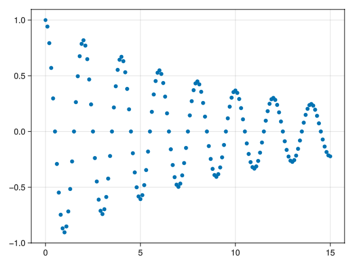
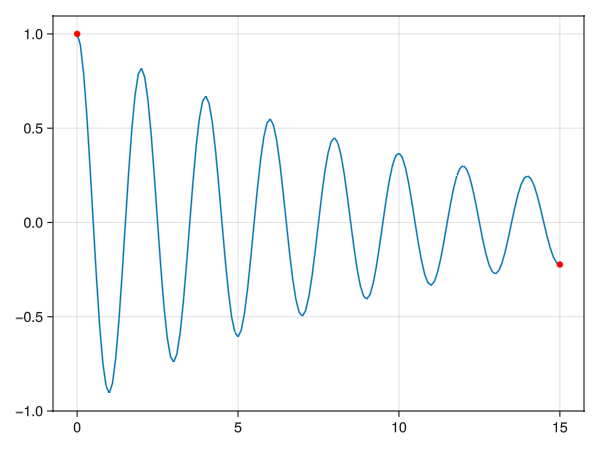
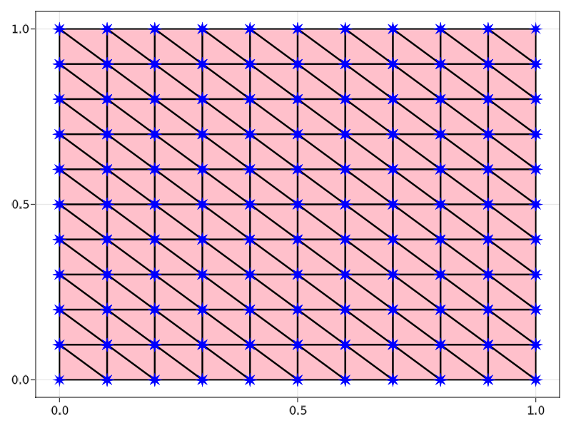
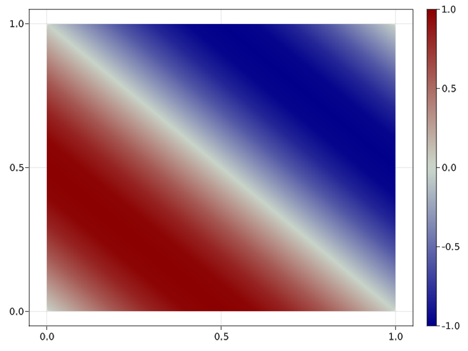
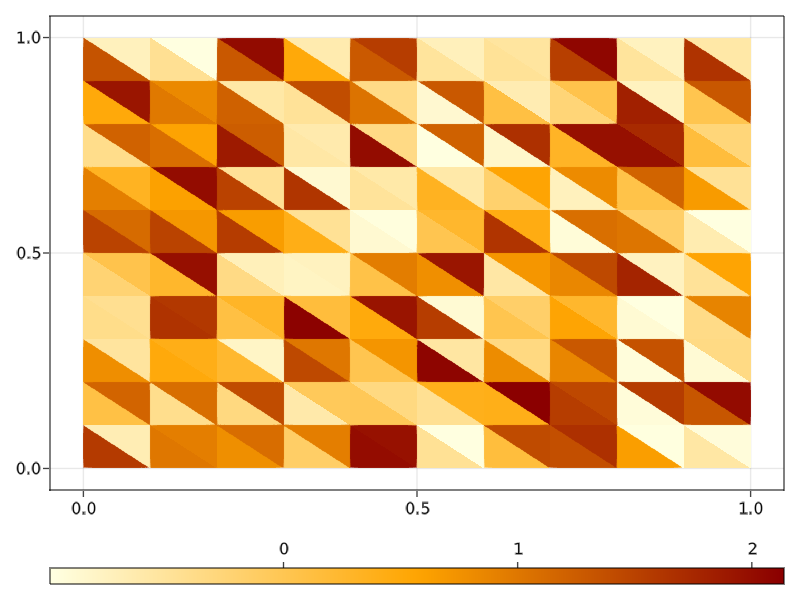
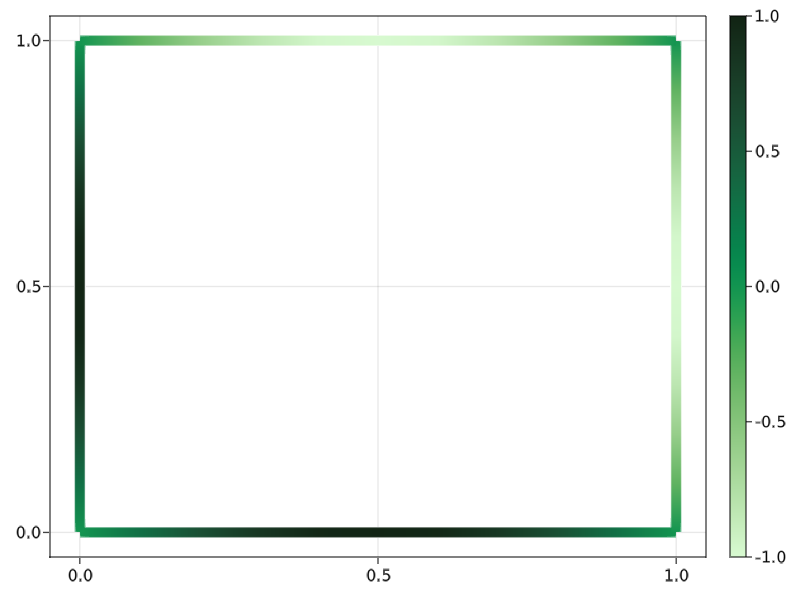
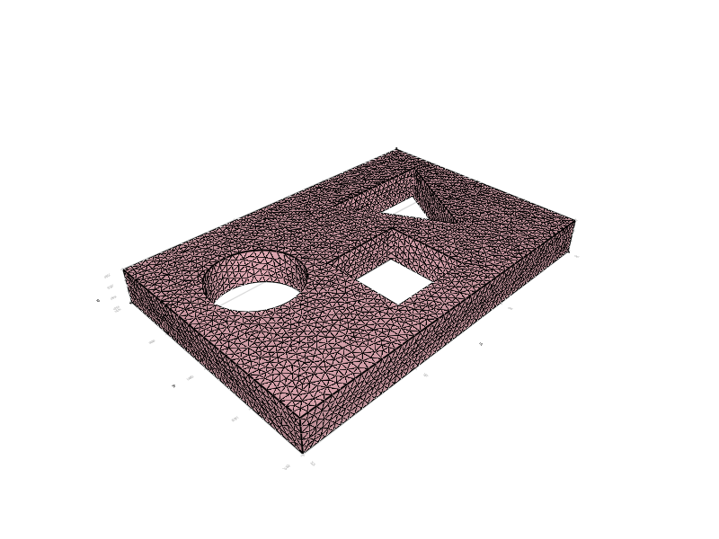
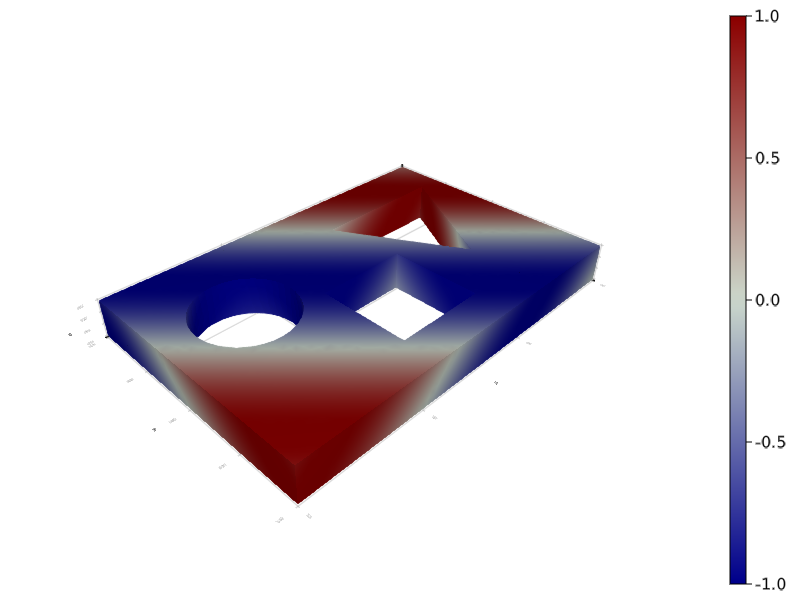
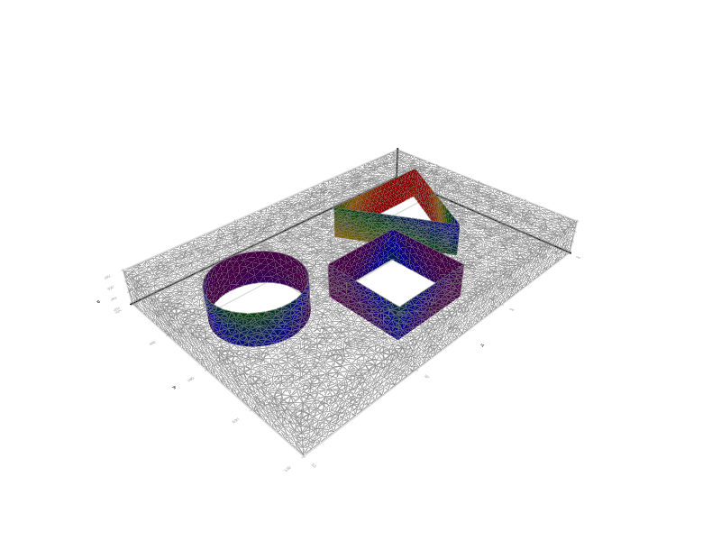

```@meta
CurrentModule = GridapMakieExt
```

# GridapMakieExt


## Overview

The visualization of numerical results is an important part of finite element (FE) computations. An approach available to visualize data of [Gridap.jl](https://github.com/gridap/Gridap.jl) computations is to write simulation
data to data files (e.g., in vtu format) for later visualization with, e.g., Paraview or VisIt. From the idea of visually inspecting
data from Julia code directly or to manipulate it with packages of the Julia
open-source package ecosystem, [GridapMakie.jl](https://github.com/gridap/GridapMakie.jl) is born. As a part of the Google Summer of
Code 2021 program, GridapMakie adopts [Makie.jl](https://github.com/JuliaPlots/Makie.jl) as a second visualization back-end for
Gridap.jl simulations. This package is thought as a built-in tool to assess the user in their FE calculations with a smoother workflow
in a highly intuitive API.
`GridapMakie.jl` is now an extension of `Gridap.jl` named `GridapMakieExt`.

## Acknowledgement

A significant part of this package has been developed in the framework of the Google Summer of Code 2021 project [[Gridap] Visualizing PDE approximations in Julia with Gridap.jl and Makie.jl](https://summerofcode.withgoogle.com/projects/#6231266174697472).

## Installation

According to Makie's guidelines, it is enough to install one of its backends, e.g. GLMakie.

```julia
julia> ]
pkg> add GLMakie
```

## Examples

First things first, we shall be using the packages `Gridap` and `GLMakie`.
We may as well create directories to store downloaded meshes and output files

````julia
using Gridap, GLMakie
mkdir("models")
mkdir("images")
````
### 1D Plots
Let us consider a 1D triangulation Ω, a function `u` and the corresponding FE function `uh` constructed with Gridap
````julia
model = CartesianDiscreteModel((0,15),150)
Ω = Triangulation(model)
reffe = ReferenceFE(lagrangian, Float64, 1)
V = FESpace(model, reffe)
u=x->cos(π*x[1])*exp(-x[1]/10)
uh = interpolate(u, V)
````

The visualization of the function can be achieved as follows
````julia
fig=plot(uh)
save("images/1d_Fig1.png", fig)
````

<p align="center">

</p>

We may also plot the function with a line and its value at the boundaries
````julia
Γ = BoundaryTriangulation(model)
fig=lines(Ω,u)
plot!(Γ,uh,color=:red)
save("images/1d_Fig2.png", fig)
````

<p align="center">

</p>

### 2D Plots

Then, let us consider a simple, 2D simplexified cartesian triangulation Ω

````julia
domain = (0, 1, 0, 1)
cell_nums = (10, 10)
model = CartesianDiscreteModel(domain, cell_nums) |> simplexify
Ω = Triangulation(model)
````

The visualization of the vertices, edges, and faces of Ω can be achieved as follows

````julia
fig = plot(Ω)
wireframe!(Ω, color=:black, linewidth=2)
scatter!(Ω, marker=:star8, markersize=20, color=:blue)
save("images/2d_Fig1.png", fig)
````

<p align="center">

</p>

We now consider a FE function `uh` constructed with Gridap

````julia
reffe = ReferenceFE(lagrangian, Float64, 1)
V = FESpace(model, reffe)
uh = interpolate(x->sin(π*(x[1]+x[2])), V)
````

and plot it over Ω, adding a colorbar

````julia
fig, _ , plt = plot(Ω, uh)
Colorbar(fig[1,2], plt)
save("images/2d_Fig11.png", fig)
````

<p align="center">

</p>

On the other hand, we may as well plot cell values

````julia
celldata = π*rand(num_cells(Ω)) .-1
fig, _ , plt = plot(Ω, color=celldata, colormap=:heat)
Colorbar(fig[2,1], plt, vertical=false)
save("images/2d_Fig13.png", fig)
````

<p align="center">

</p>

If we are only interested in the boundary of Ω, namely Γ

````julia
Γ = BoundaryTriangulation(model)
fig, _ , plt = plot(Γ, uh, colormap=:algae, linewidth=10)
Colorbar(fig[1,2], plt)
save("images/2d_Fig111.png", fig)
````

<p align="center">

</p>

### 3D Plots

In addition to the 2D plots, GridapMakie is able to handle more complex geometries. For example,
take the mesh from the [first Gridap tutorial](https://gridap.github.io/Tutorials/stable/pages/t001_poisson/#Tutorial-1:-Poisson-equation-1),
which can be downloaded using

````julia
url = "https://github.com/gridap/GridapMakie.jl/raw/d5d74190e68bd310483fead8a4154235a61815c5/_readme/model.json"
download(url,"models/model.json")
````

Therefore, we may as well visualize such mesh

````julia
model = DiscreteModelFromFile("models/model.json")
Ω = Triangulation(model)
∂Ω = BoundaryTriangulation(model)
fig = plot(Ω)
wireframe!(∂Ω, color=:black)
save("images/3d_Fig1.png", fig)
````

<p align="center">

</p>

````julia
v(x) = sin(π*(x[1]+x[2]+x[3]))
fig, ax, plt = plot(Ω, v)
Colorbar(fig[1,2], plt)
save("images/3d_Fig2.png", fig)
````

<p align="center">

</p>

we can even plot functions in certain subdomains, e.g.

````julia
Γ = BoundaryTriangulation(model, tags=["square", "triangle", "circle"])
fig = plot(Γ, v, colormap=:rainbow)
wireframe!(∂Ω, linewidth=0.5, color=:gray)
save("images/3d_Fig3.png", fig)
````

<p align="center">

</p>

### Animations and interactivity

Finally, by using Makie [Observables](https://makie.juliaplots.org/stable/interaction/nodes.html), we
can create animations or interactive plots. For example, if the nodal field has a time dependence

````julia
t = Observable(0.0)
u = lift(t) do t
    x->sin(π*(x[1]+x[2]+x[3]))*cos(π*t)
end
fig = plot(Ω, u, colormap=:rainbow, colorrange=(-1,1))
wireframe!(∂Ω, color=:black, linewidth=0.5)
framerate = 30
timestamps = range(0, 2, step=1/framerate)
record(fig, "images/animation.gif", timestamps; framerate=framerate) do this_t
    t[] = this_t
end
````

<p align="center">

</p>


