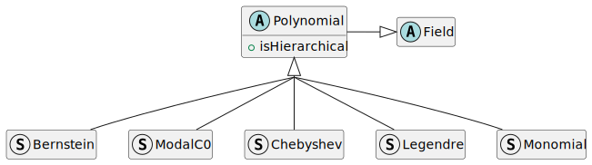
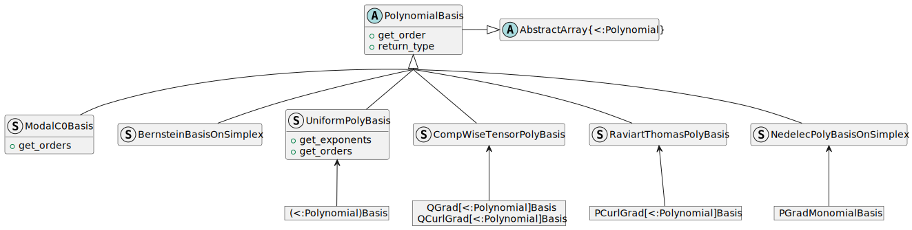

# Gridap.Polynomials

```@meta
CurrentModule = Gridap.Polynomials
```

The module documentation is organised as follows:
- Summary of the main features
- Mathematical definitions of the families of [polynomial bases](@ref "Families
    of polynomial bases") and spanned polynomial [spaces](@ref "Polynomial spaces
    in FEM")
- Docstrings of implemented [families](@ref "Types for polynomial families")
    and [bases](@ref "Polynomial bases") of polynomials
- [Low level](@ref "Low level APIs and internals") APIs, internals and
    [deprecated](@ref "Deprecated APIs") methods

### Summary

```@docs
Polynomials
```

## Mathematical definitions

### Families of polynomial bases

#### Monomials

The [`Monomial`](@ref)s are the standard basis polynomials of general
polynomial spaces. The order ``K`` 1D monomial is
```math
x \rightarrow x^K,
```
and the order ``\boldsymbol{K}=(K_1, K_2, \dots, K_D)`` D-dimensional monomial is defined by
```math
\boldsymbol{x} = (x_1, x_2, \dots, x_D) \longrightarrow
\boldsymbol{x}^{\boldsymbol{K}} = x_1^{K_1}x_2^{K_2}...x_D^{K_D} = \Pi_{i=1}^D
x_i^{K_i}.
```

#### Legendre polynomials

The Legendre polynomials are the orthogonal 1D basis recursively defined by
```math
P_0(x) = 1,\qquad
P_1(x) = x,\qquad
P_{n+1}(x) = \frac{1}{(n+1)}( (2n+1)x P_{n}(x)-n P_{n-1}(x) ),
```
the orthogonality is for the ``L^2`` scalar product on ``[-1,1]``.

This module implements the normalized shifted [`Legendre`](@ref) polynomials,
shifted to be orthogonal on ``[0,1]`` using the change of variable ``x
\rightarrow 2x-1``, leading to
```math
P^*_{n}(x)=\frac{1}{\sqrt{2n+1}}P_n(2x-1)=\frac{1}{\sqrt{2n+1}}(-1)^{n}\sum _{i=0}^{n}{\binom{n}{i}}{\binom{n+i}{i}}(-x)^{i}.
```

#### Chebyshev polynomials

The first kind Chebyshev polynomials ``T_n`` and second kind Chebyshev
polynomials ``U_n`` can be recursively defined by
```math
    T_{0}(x)=1,\qquad T_{1}(x)=\ \,x,\qquad T_{n+1}(x)=2x\,T_{n}(x)-T_{n-1}(x).\\
    U_{0}(x)=1,\qquad U_{1}(x)=2x,\qquad U_{n+1}(x)=2x\,U_{n}(x)-U_{n-1}(x).
```
or explicitly defined by
```math
T_{n}(x)=\sum _{i=0}^{\left\lfloor {n}/{2}\right\rfloor }{\binom
    {n}{2i}}\left(x^{2}-1\right)^{i}x^{n-2i},\qquad
U_{n}(x)=\sum _{i=0}^{\left\lfloor {n}/{2}\right\rfloor }{\binom
    {n+1}{2i+1}}\left(x^{2}-1\right)^{i}x^{n-2i},
```
where ``\left\lfloor {n}/2\right\rfloor`` is `floor(n/2)`.

Similarly to Legendre above, this module implements the shifted first kind
Chebyshev by [`Chebyshev{:T}`](@ref), defined by
```math
T^*_n(x) = T_n(2x-1).
```
The analog second kind shifted Chebyshev polynomials can be implemented by
[`Chebyshev{:U}`](@ref) in the future.

#### Bernstein polynomials

The univariate [`Bernstein`](@ref) polynomials forming a basis of ``\mathbb{P}_K``
are defined by
```math
B^K_{n}(x) = \binom{K}{n} x^n (1-x)^{K-n}\qquad\text{ for } 0\leq n\leq K.
```

The ``D``-multivariate Bernstein polynomials of degree ``K`` are defined by
```math
B^{D,K}_α(\boldsymbol x) = \binom{K}{α} λ(\boldsymbol x)^α\qquad\text{for } |α|=K
```
where
- ``α`` belongs to ``I_{D,K}=\{ α\in \llbracket 0, K\rrbracket^{N} \quad\big|\quad |α| = K \}`` where ``N = D+1``
- ``\binom{|α|}{α} = \frac{|α|!}{α!} = \frac{K!}{α_1 !α_2 !\dotsα_N!}`` and ``K=|α|=\sum_{1\leq i\leq N} α_i``
- ``λ(\boldsymbol x) = \big(x_1,\, x_2,\, \dots,\, x_D,\, 1-\sum_{1\leq i\leq D} x_i\big)``

This ``λ`` is the barycentric coordinates relative to the reference D-simplex
```math
    \Big\{ \boldsymbol{x}\in\mathbb{R}^D \quad\big|\quad x_i\geq 0\ \forall i,\quad \sum_i x_i\leq 1 \Big\}.
```

The superscript ``D`` and ``K`` can be omitted because they are always
determined by ``α`` using ``D=\#(α)-1`` and ``K=|α|``.
The set ``\{B_α\}_{α\in I_{D,K}}`` is a basis of
``\mathbb{P}^D_K``, implemented by [`BernsteinBasisOnSimplex`](@ref).

The Bernstein polynomials sum to ``1``, and are positive on their corresponding reference D-simplex.

#### ModalC0 polynomials

The [`ModalC0`](@ref) polynomials are 1D hierarchical and orthogonal
polynomials ``\phi_K`` for which ``\phi_K(0) = \delta_{0K}`` and ``\phi_K(1) =
\delta_{1K}``. This module implements the generalised version introduced in Eq.
17 of [Badia-Neiva-Verdugo 2022](https://doi.org/10.1016/j.camwa.2022.09.027).

When `ModalC0` is used as a `<:Polynomial` parameter in
[`UniformPolyBasis`](@ref) or other bases (except `ModalC0Basis`), the trivial
bounding box `(a=Point{D}(0...), b=Point{D}(1...))` is assumed, which
coincides with the usual definition of the ModalC0 bases.


### Polynomial spaces in FEM

#### P and Q spaces

Let us denote ``\mathbb{P}_K(x)`` the space of univariate polynomials of order up to ``K`` in the varible ``x``
```math
\mathbb{P}_K(x) = \text{Span}\big\{\quad x\rightarrow x^i \quad\big|\quad 0\leq i\leq K \quad\big\}.
```

Then, ``\mathbb{Q}^D`` and ``\mathbb{P}^D`` are the spaces for Lagrange elements
on D-cubes and D-simplices respectively, defined by
```math
\mathbb{Q}^D_K = \text{Span}\big\{\quad \bm{x}\rightarrow\bm{x}^α \quad\big|\quad 0\leq
    α_1, α_2, \dots, α_D \leq K \quad\big\},
```
and
```math
\mathbb{P}^D_K = \text{Span}\big\{\quad \bm{x}\rightarrow\bm{x}^α \quad\big|\quad 0\leq
    α_1, α_2, \dots, α_D \leq K;\quad \sum_{d=1}^D α_d \leq
    K \quad\big\}.
```

To note, there is ``\mathbb{P}_K = \mathbb{P}^1_K = \mathbb{Q}^1_K``.

#### Serendipity space Sr

The serendipity space, commonly used for serendipity finite elements on n-cubes,
are defined by
```math
\mathbb{S}r^D_K = \text{Span}\big\{\quad \bm{x}\rightarrow\bm{x}^α \quad\big|\quad 0\leq
    α_1, α_2, \dots, α_D \leq K;\quad
    \sum_{d=1}^D α_d\;\mathbb{1}_{[2,K]}(α_d) \leq K \quad\big\}
```
where ``\mathbb{1}_{[2,K]}(α_d)`` is ``1`` if ``α_d\geq 2`` or else
``0``.

#### Homogeneous P and Q spaces

It will later be useful to define the homogeneous Q spaces
```math
\tilde{\mathbb{Q}}^D_K = \mathbb{Q}^D_K\backslash\mathbb{Q}^D_{K-1} =
    \text{Span}\big\{\quad \bm{x}\rightarrow\bm{x}^α \quad\big|\quad 0\leq α_1,
    α_2, \dots, α_D \leq K; \quad \text{max}(α) = K \quad\big\},
```
and homogeneous P spaces
```math
\tilde{\mathbb{P}}^D_K = \mathbb{P}^D_K\backslash \mathbb{P}^D_{K-1} =
    \text{Span}\big\{\quad \bm{x}\rightarrow\bm{x}^α \quad\big|\quad 0\leq α_1,
    α_2, \dots, α_D \leq K;\quad \sum_{d=1}^D α_d = K \quad\big\}.
```


#### Nédélec spaces

The Kᵗʰ Nédélec polynomial spaces on respectively rectangles and
triangles are defined by
```math
\mathbb{ND}^2_K(\square) = \left(\mathbb{Q}^2_K\right)^2 \oplus
    \left(\begin{array}{c} y^{K+1}\,\mathbb{P}_K(x)\\ x^{K+1}\,\mathbb{P}_K(y) \end{array}\right)
,\qquad
\mathbb{ND}^2_K(\bigtriangleup) =\left(\mathbb{P}^2_K\right)^2 \oplus\bm{x}\times(\tilde{\mathbb{P}}^2_K)^2,
```
where ``\times`` here means ``\left(\begin{array}{c} x\\ y
\end{array}\right)\times\left(\begin{array}{c} p(\bm{x})\\ q(\bm{x})
\end{array}\right) = \left(\begin{array}{c} y p(\bm{x})\\ -x q(\bm{x})
\end{array}\right)`` and ``\oplus`` is the direct sum of vector spaces.

Then, the Kᵗʰ Nédélec polynomial spaces on respectively hexahedra and
tetrahedra are defined by
```math
\mathbb{ND}^3_K(\square) = \left(\mathbb{Q}^3_K\right)^3 \oplus \bm{x}\times(\tilde{\mathbb{Q}}^3_K)^3,\qquad
\mathbb{ND}^3_K(\bigtriangleup) =\left(\mathbb{P}^3_K\right)^3 \oplus \bm{x}\times(\tilde{\mathbb{P}}^3_K)^3.
```

``\mathbb{ND}^D_K(\square)`` and ``\mathbb{ND}^D_K(\bigtriangleup)`` are of
order K+1 and the curl of their elements are in ``(\mathbb{Q}^D_K)^D``
and ``(\mathbb{P}^D_K)^D`` respectively.

#### Raviart-Thomas spaces

The Kᵗʰ Raviart-Thomas polynomial spaces on respectively D-cubes and
D-simplices are defined by
```math
\mathbb{ND}^D_K(\square) = \left(\mathbb{Q}^D_K\right)^D \oplus \bm{x}\;\tilde{\mathbb{Q}}^D_K, \qquad
\mathbb{ND}^D_K(\bigtriangleup) = \left(\mathbb{P}^D_K\right)^D \oplus \bm{x}\;\tilde{\mathbb{P}}^D_K,
```
these bases are of dimension K+1 and the divergence of their elements are in
``\mathbb{Q}^D_K`` and ``\mathbb{P}^D_K`` respectively.


#### Filter functions

Some `filter` functions are used to select which terms of a `D`-dimensional
tensor product space of 1D polynomial bases are to be used to create a
`D`-multivariate basis. When a filter can be chosen, the default filter is
always the trivial filter for space of type ℚ, yielding the full tensor-product
space.

The signature of the filter functions should be

    (term,order) -> Bool

where `term` is a tuple of `D` integers containing the exponents of a
multivariate monomial, that correspond to the multi-index ``α`` previously
used in the P/Q spaces definitions.

The following example filters can be used to define associated polynomial spaces:

| space       | filter                                                       | possible family                       |
| :-----------| :------------------------------------------------------------| :------------------------------------ |
| ℚᴰ          | `_q_filter(e,order) = maximum(e) <= order`                   | All                                   |
| ℚᴰₙ\\ℚᴰₙ₋₁  | `_qh_filter(e,order) = maximum(e) == order`                  | [`Monomial`](@ref)                    |
| ℙᴰ          | `_p_filter(e,order) = sum(e) <= order`                       | All                                   |
| ℙᴰₙ\\ℙᴰₙ₋₁  | `_ph_filter(e,order) = sum(e) == order`                      | [`Monomial`](@ref)                    |
| 𝕊rᴰₙ        | `_ser_filter(e,order) = sum( i for i in e if i>1 ) <= order` | [`hierarchical`](@ref isHierarchical) |

## Types for polynomial families

The following types represent particular polynomial bases 'families' or 'types', later
shortened as `PT` in type parameters.

```@docs
Polynomial
```

!!! warning
    [`Polynomial`](@ref)s do not implement the `Field` interface, only the
    [`PolynomialBasis`](@ref) can be evaluated.


```@docs
isHierarchical
Monomial
Legendre
Chebyshev
```
!!! todo
    Second kind `Chebyshev{:U}` are not implemented yet.

```@docs
Bernstein
ModalC0
```

## Polynomial bases

```@docs
PolynomialBasis
get_order(::PolynomialBasis)
MonomialBasis(args...)
MonomialBasis
LegendreBasis(args...)
LegendreBasis
ChebyshevBasis(args...)
ChebyshevBasis
BernsteinBasis(args...)
```
!!! warning
    Calling `BernsteinBasis` with the filters (e.g. a `_p_filter`) rarely
    yields a basis for the associated space (e.g. ``\mathbb{P}``).  Indeed, the
    term numbers do not correspond to the degree of the polynomial, because the
    basis is not [`hierarchical`](@ref isHierarchical).

```@docs
BernsteinBasis
BernsteinBasisOnSimplex
PGradBasis
QGradBasis
PCurlGradBasis
QCurlGradBasis
```
## Low level APIs and internals



```@docs
UniformPolyBasis
UniformPolyBasis(::Type, ::Val{D}, ::Type, ::Int, ::Function) where D
UniformPolyBasis(::Type, ::Val{D}, ::Type{V}, ::NTuple{D,Int}, ::Function) where {D,V}
get_orders(::UniformPolyBasis)
get_exponents
CompWiseTensorPolyBasis
NedelecPolyBasisOnSimplex
RaviartThomasPolyBasis
ModalC0Basis
ModalC0Basis()
```

### Deprecated APIs

```@docs
num_terms
PGradMonomialBasis
PCurlGradMonomialBasis
QGradMonomialBasis
QCurlGradMonomialBasis
JacobiPolynomialBasis
```
