```@meta
CurrentModule = Gridap.ReferenceFEs
```

# Gridap.ReferenceFEs

#### Contents

```@contents
Pages = ["ReferenceFEs.md"]
Depth = 2:3
```

## Reference FE summary

A reference finite element is defined using the following signature
```@docs; canonical=false
ReferenceFE(::ReferenceFEName, args...; kwargs...)
```

The following table summarizes the elements implemented in Gridap (legend below).

| Name                                                                                    | Gridap name                                  | FEEC name | Polytopes   | Order           | Conformity|
| :-------------------------------------------------------------------------------------- | :------------------------------------------- | :-------- | :---------- | --------------: | :-------- |
| [Lagrangian](https://defelement.org/elements/lagrange.html)                             | [`lagrangian`](@ref LagrangianRefFE)         | 𝓟ᵣ⁽⁻⁾Λ⁰   | △           | ``{r=o≥1, o}``  | `:H1`     |
|                                                                                         |                                              | 𝓠ᵣ⁻Λ⁰     | ``\square`` | ``{r=o≥1, o}``  | `:H1`     |
|                                                                                         |                                              |     |`WEDGE`, `PYRAMID` | ``{o≥1, o}``    | `:H1`     |
| [Serendipity](https://defelement.org/elements/serendipity.html)                         | [`serendipity`](@ref SerendipityRefFE)       | 𝓢ᵣΛ⁰      | ``\square`` | ``{r=o≥1, o}``  | `:H1`     |
| [Bezier](https://defelement.org/elements/bernstein.html)                                | [`bezier`](@ref BezierRefFE)                 | 𝓟ᵣ⁻Λ⁰     | △           | ``{r=o≥1, o}``  | `:H1`     |
|                                                                                         |                                              | 𝓠ᵣ⁻Λ⁰     | ``\square`` | ``{r=o≥1, o}``  | `:H1`     |
| [ModalC0](https://doi.org/10.48550/arXiv.2201.06632)                                    | [`modalC0`](@ref ModalC0RefFE)               | 𝓠ᵣ⁻Λ⁰     | ``\square`` | ``{r=o≥1, o}``  | `:H1`     |
|                                                                                                                                                                                                |
| [Nédélec (first kind)](https://defelement.org/elements/nedelec1.html)                   | [`nedelec`](@ref NedelecRefFE)               | 𝓟ᵣ⁻Λ¹     | `TRI`,`TET` | ``{r=o+1≥1, r}``| `:Hcurl`  |
|                                                                                         |                                              | 𝓠ᵣ⁻Λ¹     | `QUAD`,`HEX`| ``{r=o+1≥1, r}``| `:Hcurl`  |
| [Nédélec (second kind)](https://defelement.org/elements/nedelec2.html)                  | `TODO`                                       | 𝓟ᵣΛ¹      | `TRI`,`TET` | ``{r=o≥1,   r}``| `:Hcurl`  |
|                                                                                                                                                                                                |
| [Raviart-Thomas](https://defelement.org/elements/raviart-thomas.html)                   | [`raviart_thomas`](@ref LagrangianRefFE)     | 𝓟ᵣ⁻Λᴰ⁻¹   | `TRI`,`TET` | ``{r=o+1≥1, r}``| `:Hdiv`   |
|                                                                                         |                                              | 𝓠ᵣ⁻Λᴰ⁻¹   | `QUAD`,`HEX`| ``{r=o+1≥1, r}``| `:Hdiv`   |
| [Brezzi-Douglas-Marini](https://defelement.org/elements/brezzi-douglas-marini.html)     | [`bdm`](@ref BDMRefFE)                       | 𝓟ᵣΛᴰ⁻¹    | `TRI`,`TET` | ``{r=o≥1,   r}``| `:Hdiv`   |
| [Mardal-Tai-Winther](https://defelement.org/elements/mardal-tai-winther.html)           | `TODO` `mtw`                                 |           | `TRI`,`TET` | ``{o=1, D+1}``  | `:Hdiv`   |
|                                                                                                                                                                                                |
| [Crouzeix-Raviart](https://defelement.org/elements/crouzeix-raviart.html)               |[`couzeix_raviart`](@ref CrouzeixRaviartRefFE)|           |  `TRI`      | ``{o=1, o}``    | `:L2`     |
| [discontinuous Lagrangian](https://defelement.org/elements/discontinuous-lagrange.html) | [`lagrangian`](@ref LagrangianRefFE)         | 𝓟ᵣ⁻Λᴰ     | △           | ``{r-1=o≥0, o}``| `:L2`     |
|                                                                                         |                                              | 𝓟ᵣΛᴰ      | △           | ``{r=o≥0, o}``  | `:L2`     |
|                                                                                         |                                              | 𝓠ᵣ⁻Λᴰ     | ``\square`` | ``{r-1=o≥0, o}``| `:L2`     |
|                                                                                         |                                              | 𝓢ᵣΛᴰ      | ``\square`` | ``{r=o≥0, o}``  | `:L2`     |
| [MINI bubble](@ref "Bubble reference FE")                                               | [`bubble`](@ref BubbleRefFE)                 |           |△,``\square``| ``{o=1, 2}``    | `:L2`     |
| Bezier, ModalC0                                                                         | as above                                     |           |             | ``{o≥0, o}``    | `:L2`     |
|                                                                                                                                                                                                |
| [Arnold-Winther](https://defelement.org/elements/arnold-winther.html)                   | `TODO`  `arnoldwinther`                      |           | `TRI`       | ``{o=2, 4}``    | `:Hdiv`   |
| [Hellan-Herrmann-Jhonson](https://defelement.org/elements/hellan-herrmann-johnson.html) | `TODO`  `hhj`                                |           | `TRI`       | ``{TODO, o}``   | `:Hdiv`   |

##### Legend

- Name: usual name of the element and link to its
    [DefElement](https://defelement.org/) page, containing all the details
    defining the element and references.
- Gridap name: the name  to use in the Gridap APIs (it is a [`ReferenceFEName`](@ref ReferenceFEs.ReferenceFEName)
    singleton), with a link to the docstring of the element constructor.
- FEEC name: name of the element family in the [Periodic Table of the Finite
    Elements](https://www-users.cse.umn.edu/~arnold/femtable/index.html) [1]
- Polytopes:
  - △ simplices (`SEGMENT`, `TRI`  (triangle),      `TET` (tetrahedron))
  - ``\square`` n-cubes   (`SEGMENT`, `QUAD` (quadridateral), `HEX` (hexahedron))
- Order: ( _definition of ``r`` and ``o``_; _``k``_ ) where
  - ``r`` is the FEEC polynomial degree parameter (if defined).
  - ``o`` is the `order` parameter of the non FEEC `ReferenceFE` constructor (using [`name::ReferenceFEName`](@ref ReferenceFEName)),
  - ``k`` is the maximum polynomial order of the shape functions in one direction (Lagrange superdegree), defined in function of ``r`` or ``o``,
- Conformity: supported [`Conformity`](@ref). All the elements also implement `:L2` conformity.

#### Additional information

###### Anisotropic and Cartesian product elements

The `lagrangian`, `modalC0` and `bezier` elements support anisotropic orders on
`QUAD` and `HEX`, leveraging the tensor product basis in each dimension.

Also, a Cartesian product finite-element space is available for `lagrangian`,
`serendipity` and `modalC0` elements, for all polytopes. It means that a tensor
type ([`<:MultiValue`](@ref Gridap.TensorValues)) can be given as value type
argument `T`, for example `VectorValue{3,Float64}` or
`SymTensorValue{2,Float64}`. The DoFs are duplicated for each independent
component of the tensor.

The `modalC0` element has the particularity that the support of its
shape-function can be scaled to be adapted to the physical element.

###### `poly_type` and `mom_poly_type` keyword arguments

The `lagrangian`, `nedelec`, `raviart_thomas`, `bdm` and `serendipity` element
constructors support the `poly_type::Type{<:Polynomial}` keyword argument,
which gives the choice of the polynomial family to use as (pre-)basis for the
approximation space of the element. This changes the *basis* but not the
spanned polynomial *space* (for affine-mapped reference elements).

Additionally, the `nedelec`, `raviart_thomas` and `bdm` element constructors
support the `mom_poly_type::Type{<:Polynomial}` keyword argument, which gives
the choice of the polynomial basis to use as "test" polynomials in the moment
functionals defining the DoFs (``q`` in [1, eq. (2)]). `mom_poly_type` defaults
to `poly_type`.

The `mom_poly_type` and [`sh_is_pb`](@ref "Geometric decompositions") keywords
change the choice of DoF *basis*, but not the DoF *space* (polynomial space dual).

###### Bubble reference FE

The [`BubbleRefFE`](@ref) currently implements bubble space for MINI element,
but the bubble can be fine-tuned. The MINI element on `TRI`angle is documented
[here](https://defelement.org/elements/mini.html).

```@docs
ReferenceFEs
```

## Polytopes

### Abstract API

```@autodocs
Modules = [ReferenceFEs,]
Order   = [:type, :constant, :macro, :function]
Pages   = ["/Polytopes.jl"]
```

### Extrusion Polytopes

| Name | Extrusion | Nodes | Edges | Faces |
| :--- | :-------- | :---- | :---- | :---- |
| `SEGMENT` | `(HEX,)` | 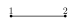 | |  |
| `TRI` | `(TET,TET)` | 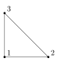 | 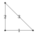 | |
| `QUAD` | `(HEX,HEX)` | 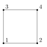 | 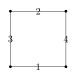 | |
| `HEX` | `(HEX,HEX,HEX)` | 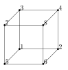 | 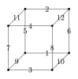 | 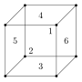 |
| `TET` | `(TET,TET,TET)` | 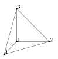 | 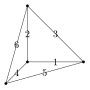 | 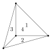 |
| `WEDGE` | `(TET,TET,HEX)` | 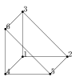 | 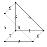 | 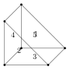 |
| `PYRAMID` | `(HEX,HEX,TET)` | 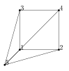 | 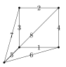 | 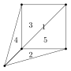 |

```@autodocs
Modules = [ReferenceFEs,]
Order   = [:type, :constant, :macro, :function]
Pages   = ["ExtrusionPolytopes.jl"]
```

### General Polytopes

```@autodocs
Modules = [ReferenceFEs,]
Order   = [:type, :constant, :macro, :function]
Pages   = ["GeneralPolytopes.jl"]
```

## Quadratures

### Abstract API

```@autodocs
Modules = [ReferenceFEs,]
Order   = [:type, :constant, :macro, :function]
Pages   = ["/Quadratures.jl"]
```

### Available Quadratures

```@autodocs
Modules = [ReferenceFEs,]
Order   = [:type, :constant, :macro, :function]
Pages   = ["TensorProductQuadratures.jl","DuffyQuadratures.jl","StrangQuadratures.jl","XiaoGimbutasQuadratures.jl"]
```

## ReferenceFEs

### Abstract API

```@autodocs
Modules = [ReferenceFEs,]
Order   = [:type, :constant, :macro, :function]
Pages   = ["ReferenceFEInterfaces.jl","Dofs.jl","LinearCombinationDofVectors.jl","Pullbacks.jl"]
```

### Nodal ReferenceFEs

```@autodocs
Modules = [ReferenceFEs,]
Order   = [:type, :constant, :macro, :function]
Pages   = ["LagrangianRefFEs.jl","LagrangianDofBases.jl","SerendipityRefFEs.jl","BezierRefFEs.jl","ModalC0RefFEs.jl","BubbleRefFEs.jl"]
```

### Moment-Based ReferenceFEs

#### Framework

```@autodocs
Modules = [ReferenceFEs,]
Order   = [:type, :constant, :macro, :function]
Pages   = ["MomentBasedReferenceFEs.jl"]
```

##### Geometric decompositions

The geometric decomposition API consist in the methods
- [`has_geometric_decomposition(polybasis,p,conf)`](@ref),
- [`get_face_own_funs(polybasis,p,conf)`](@ref),
- [`get_facet_flux_sign_flip(polybasis,p,conf)`](@ref).
where `polybasis` is a polynomial basis, `p` a polytope and `conf` a conformity.

This API ensures that:
- each polynomial ``𝑝_i`` of the basis is associated to a face ``f`` of `p`,
- the `conf`-trace of ``𝑝_i`` (scalar trace, tangential trace,
    normal trace) over another face ``g`` of `p` is zero whenever ``g`` does not
    contain ``f``, and
- the polynomials owned by boundary faces can be glued together with conformity
    `conf` in the physical space.

The bases that currently support the geometric decomposition are:
- those of ``P^-Λ^k`` and ``PΛ^k`` spaces for `Bernstein` polynomial type (on simplices), see also Bernstein basis [Geometric decomposition](@ref "Geometric decomposition"),
- those of ``Q^-Λ^k`` spaces for `ModalC0` and `Bernstein` polynomial types (on n-cubes),
- those of ``SΛ^0`` spaces for `ModalC0` polynomial types (on n-cubes).

The keyword argument `sh_is_pb=true` means that, if possible, the shape
functions are defined as the basis polynomials of the pre-basis. This is
possible if the pre-basis verifies a geometric decomposition. Setting
`sh_is_pb=false` forces the shape functions to be defined as the dual basis of
the DoF basis. This kwarg do not alter the polynomial space and dual space
respectively spanned by the shape-functions and the DoFs basis, but does change
the DoF basis choice for the dual space.

The kwarg `sh_is_pb` is available for Lagrangian, BDM, Raviart-Thomas, Nédélec
and Serendipity elements. It defaults to true except for Lagrangian and
Serendipity. `sh_is_pb` is ignored if the pre-basis for the given `poly_type <:
Polynomial` does not admit the geometric decomposition.

```@autodocs
Modules = [ReferenceFEs,]
Order   = [:type, :macro, :function, :constant]
Pages   = ["GeometricDecompositions.jl"]
```

#### Available Moment-Based ReferenceFEs

```@autodocs
Modules = [ReferenceFEs,]
Order   = [:type, :constant, :macro, :function]
Pages   = ["RaviartThomasRefFEs.jl","NedelecRefFEs.jl","BDMRefFEs.jl","CrouzeixRaviartRefFEs.jl"]
```

## References

[1] [D.N. Arnold and A. Logg, Periodic Table of the Finite Elements, SIAM News, vol. 47 no. 9, November 2014.](https://www-users.cse.umn.edu/~arnold/papers/periodic-table.pdf)
